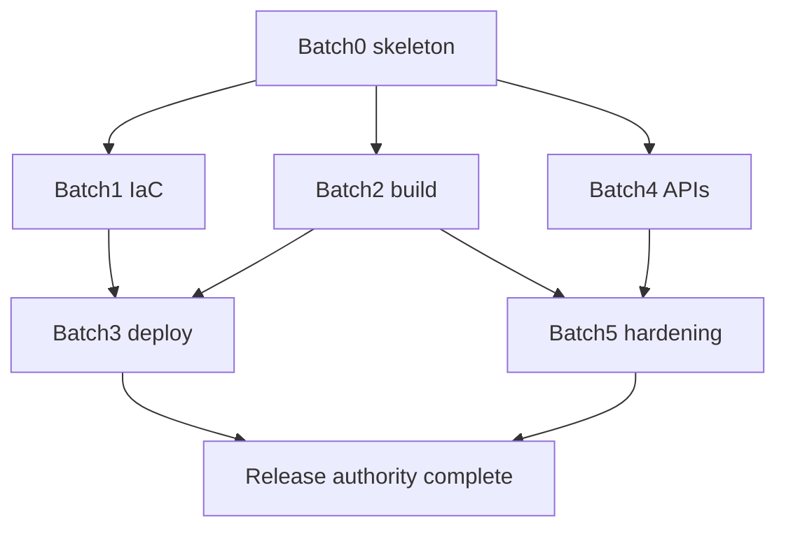

# ADR-0015 / SPEC-0015 implementation blueprint (archive)

Status: **Historical snapshot** (2026-03-01). Non-authoritative for current
operations—verify live posture against
[ADR-0015](../../../architecture/adr/ADR-0015-nova-api-platform-final-hosting-and-deployment-architecture-2026.md),
[SPEC-0015](../../../architecture/spec/SPEC-0015-nova-api-platform-final-topology-and-delivery-contract.md),
and [requirements](../../../architecture/requirements.md).

**Also see:** [Runbooks index](../../../runbooks/README.md)

---

## For AI agents: what this file is

1. **Locked target (ADR-0015):** Production = **ECS/Fargate + ALB + CodeDeploy
   blue/green + GitHub Actions OIDC** (weighted **9.3/10**). Any “ECS Express”
   style shortcut is **accelerator-only**, not rollback or governance authority.
2. **SPEC-0015 (at snapshot):** **Planned**—artifact/workflow contract and
   platform capability bar documented; implementation tracked on branches, not
   assumed done here.
3. **Gap mental model:** Many workflow **files** and **infra templates** already
   existed on `main`. Remaining work was **contract hardening** (digests,
   manifests, permissions), **complete blue/green IaC**, **`/v1/*` APIs**, and
   **CodeArtifact promotion gates**—not inventing filenames from scratch.
4. **Strategy picked:** **Option B** (9.4/10)—direct final-state cut in-repo.
   Rejected: minimal additive rollout (7.8—dual authority); infra-first then
   API (8.6—slows clients).

**Docs anchor (evidence):** PR #22, commit `23956b3`—“finalize 2026 Nova API
platform ADR/SPEC” on `main`.

## Authority layout (at snapshot)

| Source | Role |
| --- | --- |
| ADR-0015 | Accepted; topology decision record |
| SPEC-0015 | Planned; delivery artifact + API contract |
| `docs/plan/PLAN.md` | Superseded planning baseline (transition notes) |
| `docs/runbooks/**` | Canonical operator instructions |

## Foundation vs open work (at snapshot)

**In tree already:** `ci.yml`, `conformance-clients.yml`,
`build-and-publish-image.yml`, `publish-packages.yml`, `verify-signature.yml`;
`infra/runtime/**`, `infra/nova/**`; OIDC on image-build path.

**Still open:** Authoritative **CodeDeploy blue/green** end-to-end; **immutable
digest** handoffs build→deploy→promote; **rollback alarms** wired in IaC;
**`/v1/*`** capability endpoints + **conformance-clients** for Dash/Shiny/TS;
**staged→prod CodeArtifact** policy automation; **cost/retention/scaling**
defaults in env templates.

## Completion bar (target production authority)

When done, all of the following must hold:

1. ECS/Fargate services (API + workers) behind ALB.
2. API rollout via **CodeDeploy blue/green** with alarm-driven rollback.
3. Deploy identity via **GitHub Actions OIDC**, least-privilege IAM.
4. **This repo** is the single operational source for IaC + release/deploy
   workflows (no shadow deploy path).

## Work batches (single WBS—no separate “missing” list)

| Batch | Focus | Deliverables (minimum) | Accept when |
| --- | --- | --- | --- |
| **0** | Contract / skeleton | Workflow set matches SPEC-0015 naming; guarded validation jobs; machine-readable fragment for artifact names, digests, promotion inputs | Branch protection can require final check names |
| **1** | IaC blue/green | ALB listener/TG for shift; CodeDeploy ECS app + deployment group + rollback hooks; ECS service → CodeDeploy controller; WAF + alarm deps; deploy vs task IAM | Dev stack models full blue/green; DG references alarms + termination wait |
| **2** | Build / publish | Immutable ECR + **digest outputs**; CodeArtifact publish w/ staged channel + provenance/SBOM/vuln/version gates; manifest ties **digest + package versions + SHA** | Deploy jobs consume **digests only**; publish fails closed on policy |
| **3** | Deploy / promote | `deploy-dev.yml` (blue/green + smoke); `post-deploy-validate.yml` (live contract + dashboards); `promote-prod.yml` (manual approval + digest/manifest) | Dev/prod separable, audited, digest-pinned; rollback drill evidence in CI |
| **4** | `/v1/*` + clients | Jobs (+ retry semantics), job events (poll/SSE), capabilities, resources/plan, releases/info, health live/ready; client fixtures updated | `conformance-clients.yml` green; **no** retired-route shims unless ADR-approved |
| **5** | Hardening | CodeDeploy/ALB/ECS dashboards + linked alarms; OIDC trust (`sub`, `aud`, env scope); KMS/secret checks; task sizing, autoscaling bounds, budget + log retention | Right-sizing doc + alarms in templates; deploy auth fail-closed |

## Dependency graph

**Parallelism:** B0, B2 scaffolding, B4 design, B5 policy work can start early.
**Blocked:** B3 until B1+B2; “prod authority complete” until B3 + rollback
evidence.

## Exit criteria (rollout done)

1. Target workflow set exists and is **required** in branch protection.
2. Dev and prod deploy paths are **digest-pinned** and auditable.
3. **CodeDeploy blue/green** with **alarm rollback** is on the live deploy path.
4. **`/v1/*`** contract implemented; **conformance-clients** green (Dash/Shiny/TS).
5. **CodeArtifact** staged→prod promotion gates enforced.
6. **No** competing non-Nova deployment authority remains active.

## Guardrails (for the planning era)

- This blueprint PR did **not** mutate live infrastructure.
- Default posture: **final-state first**, **no shims** unless ADR-scored exception.
- When route/API baseline changes land, update authority docs in the **same** PR
  as the code.
