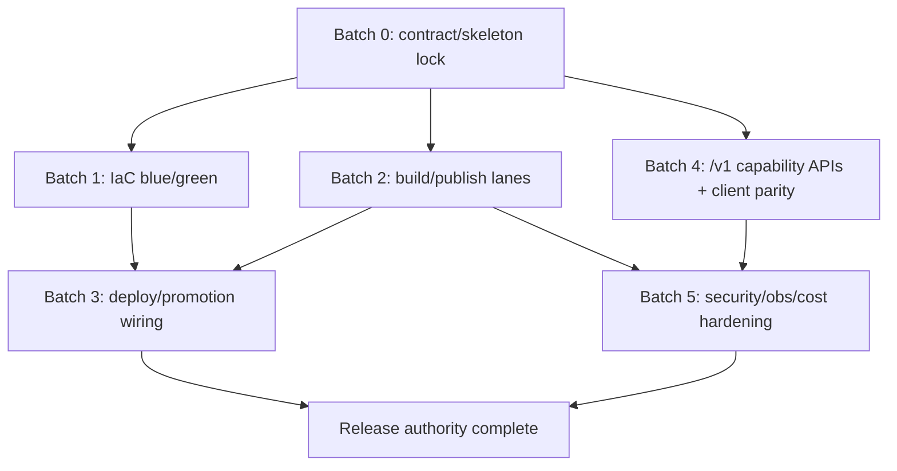

# ADR-0015 / SPEC-0015 Final Implementation Blueprint

Status: Historical archive snapshot (non-authoritative for current operations)
Owner: nova platform
Date: 2026-03-01

Related:

- [ADR-0015](../../../architecture/adr/ADR-0015-nova-api-platform-final-hosting-and-deployment-architecture-2026.md)
- [SPEC-0015](../../../architecture/spec/SPEC-0015-nova-api-platform-final-topology-and-delivery-contract.md)
- [Requirements](../../../architecture/requirements.md)
- [Runbooks index](../../../runbooks/README.md)

## 1) Final-state audit summary (evidence-based)

### 1.1 Authority state

- `ADR-0015` is **Accepted** and explicitly selects **standard ECS/Fargate + ALB + CodeDeploy blue/green + GitHub Actions OIDC** as production target-state authority (weighted score 9.3/10).
- `SPEC-0015` is **Planned** and explicitly marks implementation as pending in a future branch.
- `docs/plan/PLAN.md` is explicitly **historical/superseded baseline** with transition notes.
- `docs/runbooks/README.md` defines canonical runbook authority under `nova/docs/**`.

### 1.2 Verified recent alignment in git history

- PR #22 merged to `main` with commit `23956b3` (`docs(architecture): finalize 2026 Nova API platform ADR/SPEC`).
- Recent docs/plans updates include:
  - ADR/SPEC index alignment
  - `ADR-0015`, `SPEC-0015`
  - requirements split baseline vs target-state IDs
  - release/runbook index alignment and authority guardrails

### 1.3 Current implementation-vs-target gap snapshot

#### Already present (partial foundation)

- Workflows: `ci.yml`, `conformance-clients.yml`, `build-and-publish-image.yml`, `publish-packages.yml`, `verify-signature.yml`.
- Infra templates exist under `infra/runtime/**` and `infra/nova/**`.
- OIDC auth is already used in `build-and-publish-image.yml`.

#### Missing relative to SPEC-0015 target artifact contract

- Target workflow names/artifacts are present in `.github/workflows/` (see section above).
- Remaining workflow gap is contract hardening and authority alignment, not artifact absence.
- Explicit CodeDeploy blue/green deployment authority is not yet codified as a complete end-to-end Nova-local target-state package.
- Target `/v1/*` capability API surface is in active implementation via Batch A3 PR lane.

## 2) Options and recommendation

### Option A — Minimal additive transition layer

Score: 7.8/10

- Keep existing release workflows as authority and gradually bolt on missing pieces.
- Pros: less immediate change.
- Cons: violates final-state-first posture; extends dual-authority period.

### Option B — Direct final-state cut branch (recommended)

Score: 9.4/10

- Implement full SPEC-0015 artifact set and establish explicit production authority in this repo.
- Keep ECS Express Mode optional/accelerator-only path, not canonical.
- Pros: strongest alignment with ADR-0015 and no-shim policy.
- Cons: larger initial change set requiring tighter sequencing.

### Option C — Infra-first then API in later branch

Score: 8.6/10

- Deliver deploy pipeline and IaC first; defer `/v1/*` platform API cut.
- Pros: reduces simultaneous risk.
- Cons: prolongs contract split and slows client migration readiness.

**Recommendation:** **Option B** (>=9.0 threshold, final-state compliant, shortest route to single authority).

## 3) Definitive implementation blueprint

### 3.1 Target production authority

Primary authority (must be true at completion):

1. ECS/Fargate services (API + workers) behind ALB.
2. CodeDeploy blue/green rollout for API service.
3. GitHub Actions OIDC deploy identity with least privilege.
4. Nova-local IaC and release workflows as single operational source.

ECS Express Mode posture:

- Allowed only as optional accelerator profile for constrained scenarios.
- Explicitly non-authoritative for production governance/rollback policy.

### 3.2 Work breakdown structure (WBS)

### Batch 0 — Contract and skeleton lock (unblocked now)

- Add missing workflow skeleton files with no-op guarded jobs and required permissions model.
- Align naming (`conformance-clients.yml`) and keep old file only until cut PR completes; remove old alias in same PR if safe.
- Add machine-readable deployment contract doc fragment (artifact names, output digests, promotion inputs).

Acceptance criteria:

- All target workflow filenames exist and run on PR with at least validation steps.
- Branch protection can require new checks by final names.

### Batch 1 — IaC completion for blue/green authority (partially unblocked)

- Add/complete IaC modules for:
  - ALB listeners/target groups for blue/green traffic shifting.
  - CodeDeploy ECS application + deployment group + alarms.
  - ECS service wiring to CodeDeploy deployment controller.
  - WAF association + mandatory alarm rollback dependencies.
- Normalize IAM boundaries for deploy role/task roles.

Acceptance criteria:

- IaC diff produces complete blue/green topology in dev.
- Deployment group references rollback alarms and termination wait policy.

### Batch 2 — Artifact build/publish lanes (unblocked now)

- `build-and-publish-image.yml`: build immutable images, push to ECR, publish digest outputs.
- `publish-packages.yml`: CodeArtifact publish with staged channel and provenance/SBOM/vuln/version gates.
- Artifact metadata unification: release manifest includes image digest + package versions + source SHA.

Acceptance criteria:

- Deploy jobs consume immutable digest only (never mutable tags).
- Package publish blocked on contract + security gates.

### Batch 3 — Deployment and promotion wiring (depends on Batches 1-2)

- `deploy-dev.yml`: deploy with CodeDeploy blue/green and smoke checks.
- `post-deploy-validate.yml`: live readiness, contract checks, dashboard/alarms sanity.
- `promote-prod.yml`: manual approval gate + immutable digest/manifest promotion.

Acceptance criteria:

- Dev deploy and prod promotion are separable, audited, and digest-pinned.
- Rollback drill evidence captured in CI artifacts.

### Batch 4 — API capability surface for Dash/Shiny/TS (unblocked for design; code depends on scope lock)

- Deliver target `/v1/*` capability endpoints:
  - `/v1/jobs` CRUD+retry semantics
  - `/v1/jobs/{id}/events` poll/SSE contract
  - `/v1/capabilities`
  - `/v1/resources/plan`
  - `/v1/releases/info`
  - `/v1/health/live`, `/v1/health/ready`
- Generate/update client fixtures and contracts for Dash/Shiny/TS.

Acceptance criteria:

- `conformance-clients.yml` green across Dash/Shiny/TS lanes.
- No shim aliases introduced for retired route model unless ADR-approved.

### Batch 5 — Observability, security, cost, and right-sizing hardening (parallelizable with 2/4)

- Observability:
  - Deployment SLO dashboards and CodeDeploy/ALB/ECS linked alarms.
  - Structured post-deploy evidence bundle.
- Security:
  - OIDC trust policy constraints (`sub`, `aud`, branch/environment scoping).
  - Secret provenance and KMS policy conformance checks.
- Cost/right-sizing:
  - baseline task sizing profiles, autoscaling bounds, budget alarms, log retention tiers.

Acceptance criteria:

- Documented right-sizing matrix and alarms active in dev/prod templates.
- Security policy checks enforce fail-closed deployment auth.

## 4) Dependency graph and parallelization

### Blocked vs unblocked now

Unblocked now:

- Batch 0, Batch 2 scaffolding, Batch 4 contract design, Batch 5 policy/dashboard design.

Blocked (until dependencies land):

- Batch 3 blocked on Batch 1 + Batch 2 completion.
- Full prod authority declaration blocked on successful Batch 3 + rollback drill evidence.

## 5) Missing artifacts checklist (execution-facing)

### IaC/infra missing or incomplete

- CodeDeploy ECS blue/green app/deployment group complete templates.
- Explicit ALB dual target group + listener rule orchestration for blue/green.
- Alarm set mapped to rollback policy with deployment stop conditions.
- Environment-level cost controls (budget + retention + scaling envelope defaults).

### Workflow/deploy wiring missing

- Workflow files per SPEC-0015 naming contract.
- Digest handoff contracts between build/deploy/promote jobs.
- Post-deploy validation workflow with mandatory rollback signal checks.

### API capability gaps for downstream clients

- `/v1/*` capability endpoints not yet implemented.
- SSE/poll event contract and fixture parity for Dash/Shiny/TS.
- Release/capability discovery endpoints for adapter clients.

### CodeArtifact release/publish/deploy gates missing

- Staged-channel to prod-channel promotion automation.
- Enforced pre-publish policy checks (contract/security/version/provenance).
- Runtime deploy blocked unless package+image provenance matches manifest.

## 6) Exit criteria for ADR-0015/SPEC-0015 rollout

1. Target workflow set exists and is required in branch protection.
2. Dev and prod deploy paths are digest-pinned and auditable.
3. CodeDeploy blue/green with alarm rollback is active in deploy path.
4. `/v1/*` capability contract is implemented and conformance-green across Dash/Shiny/TS.
5. CodeArtifact staged->prod promotion gates are enforced.
6. No non-Nova deployment authority remains active.

## 7) Execution notes and guardrails

- No runtime infra mutations performed in this planning PR.
- Final-state/no-shim posture is enforced.
- Keep old baseline route authority until target code merges; then update baseline docs in same PR.
