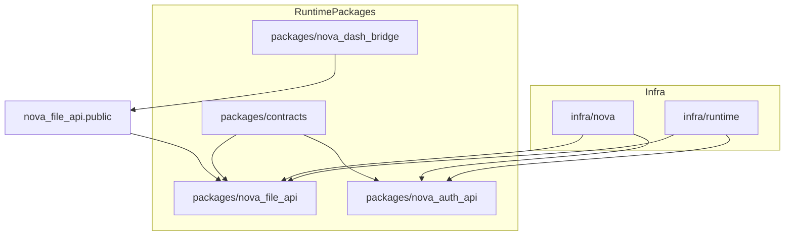
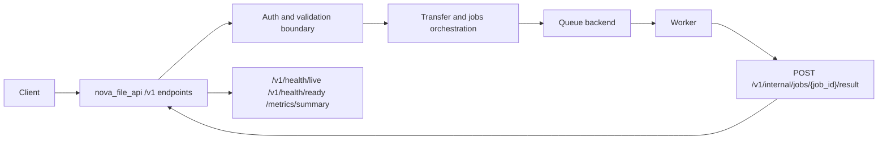
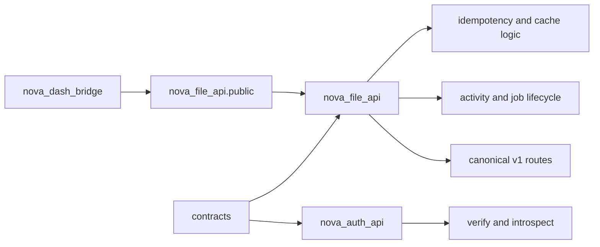
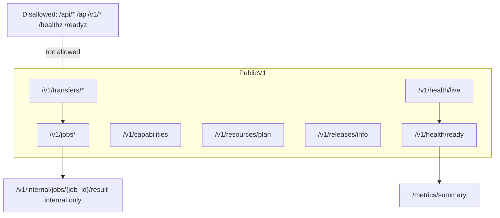
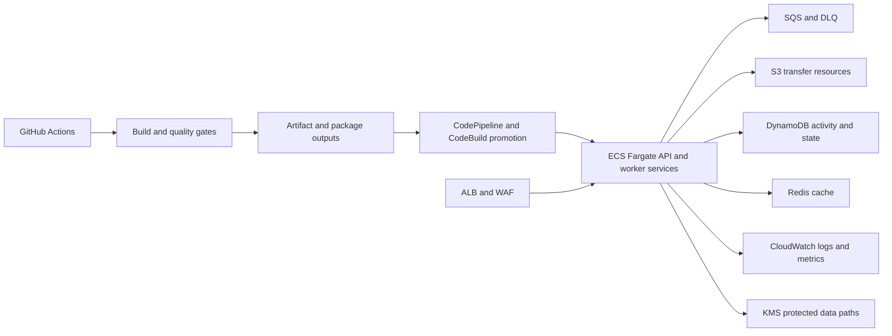
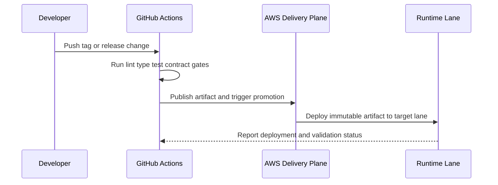

# Nova Runtime Repository Overview

## 1) What Nova is

Nova is the canonical runtime monorepo for file-transfer orchestration and token verification services. It provides a control plane for transfer and async job workflows, plus an auth API for token verify/introspect operations. Nova is not a byte-streaming proxy for file payloads; file movement is delegated through planned resources and storage integrations.

## 2) Monorepo map

- `packages/nova_file_api`: Main transfer + jobs control-plane implementation and ASGI entrypoint.
- `packages/nova_auth_api`: Token verify/introspect API implementation and ASGI entrypoint.
- `packages/nova_sdk_file`: Release-grade TypeScript file SDK within the CodeArtifact staged/prod system.
- `packages/nova_sdk_auth`: Release-grade TypeScript auth SDK within the CodeArtifact staged/prod system.
- `packages/nova_sdk_fetch`: Shared TypeScript fetch transport/runtime helper.
- `packages/nova_sdk_r_file`: First-class internal R file SDK package.
- `packages/nova_sdk_r_auth`: First-class internal R auth SDK package.
- `packages/nova_dash_bridge`: Integration bridge adapters for Dash/Flask/FastAPI clients over `nova_file_api.public`.
- `packages/contracts`: Contract artifacts, fixtures, and conformance helpers.
- `infra/nova` and `infra/runtime`: CloudFormation stacks for CI/CD foundation and runtime environments.

## Read Next

- `AGENTS.md` for the durable root operator contract
- `docs/standards/README.md` for deeper engineering standards and quality gates
- `docs/architecture/adr/ADR-0025-runtime-monorepo-component-boundaries-and-ownership.md`
  and `docs/architecture/spec/SPEC-0018-runtime-configuration-and-startup-validation-contract.md`
  for runtime ownership and safety
- `docs/runbooks/README.md` for operational runbooks

## 3) Runtime architecture at a glance

- `nova_file_api` serves canonical `/v1/*` transfer and job endpoints.
- Requests pass through auth, validation, idempotency, and service-layer orchestration.
- Async workloads are published to queue backends and completed by workers.
- Workers report completion to the internal callback endpoint (`/v1/internal/jobs/{job_id}/result`).
- Health and observability surfaces are exposed via:
  - `/v1/health/live`
  - `/v1/health/ready`
  - `/metrics/summary`
- `nova_auth_api` separately serves token verification/introspection capabilities.

## 4) Package responsibilities and interactions

- `nova_file_api` owns:
  - Transfer orchestration endpoints and request/response models.
  - Async job submission and status/result lifecycle.
  - Idempotency cache semantics and activity recording integrations.
  - Runtime capability/resource planning endpoints.
- `nova_auth_api` owns:
  - Auth token verification and introspection routes.
  - Standardized auth error envelope behavior.
- `nova_sdk_file` and `nova_sdk_auth` own:
  - Release-grade TypeScript client, operations, errors, and curated type surfaces.
  - OpenAPI-aligned request serialization for the generated SDK route surface.
  - Subpath-only packaging and staged/prod CodeArtifact publication shape.
- `nova_sdk_fetch` owns:
  - Shared fetch transport and URL helpers used by the TypeScript SDKs.
- `nova_sdk_r_file` and `nova_sdk_r_auth` own:
  - Real R package scaffolds with generated client bindings/models.
  - `logical format r` release artifacts transported through CodeArtifact generic packages.
  - Signed tarball evidence and package-native namespace/man page generation.
- `nova_dash_bridge` owns:
  - Framework adapters that let Dash/Flask/FastAPI apps consume Nova-style transfer flows without redefining server contracts.
  - Package-local adapter regression tests and architecture-boundary enforcement.
  - Consumption of the canonical in-process transfer seam through `nova_file_api.public`, not direct runtime internals.
- `contracts` owns:
  - Test fixtures, schemas, and conformance artifacts used by release and integration checks.

## 5) Canonical API surface and route guardrails

### Allowed runtime route families

- `/v1/transfers/*`
- `/v1/jobs*`
- `/v1/internal/jobs/{job_id}/result` (internal worker callback only)
- `/v1/capabilities`
- `/v1/resources/plan`
- `/v1/releases/info`
- `/v1/health/live`
- `/v1/health/ready`
- `/metrics/summary`

### Disallowed runtime route families

- `/api/*`
- `/api/v1/*`
- `/healthz`
- `/readyz`

No compatibility aliases or namespace shims should be added for disallowed families.

### High-level endpoint intent map

| Path family | Primary consumer | Intent |
| --- | --- | --- |
| `/v1/transfers/*` | External clients and app integrations | Plan and orchestrate file-transfer operations |
| `/v1/jobs*` | External clients and integrations | Submit and track async jobs |
| `/v1/internal/jobs/{job_id}/result` | Internal worker | Record job completion result |
| `/v1/capabilities` | Clients / UI / automation | Discover enabled runtime capabilities |
| `/v1/resources/plan` | Clients / operators | Get resource planning metadata |
| `/v1/releases/info` | Operators / tooling | Surface runtime release info |
| Health + metrics endpoints | Platform and operations tooling | Liveness, readiness, and summary metrics |

## 6) Client usage flows

### Transfer flow (typical)

1. Call `/v1/capabilities` to discover supported operations and policy posture.
2. Call transfer planning/creation endpoints under `/v1/transfers/*`.
3. Follow returned transfer plan details to complete storage-side actions.
4. Poll status endpoints as needed for lifecycle updates.

### Async job flow (typical)

1. Submit work via `POST /v1/jobs`.
2. Receive job metadata and track using `/v1/jobs*` read endpoints.
3. Internal worker processes queue message and posts completion to `/v1/internal/jobs/{job_id}/result`.
4. Client reads terminal state and result through public job endpoints.

### Auth usage

1. Client or service calls auth API verify/introspect endpoints for token checks.
2. Runtime services enforce auth decisions at request boundaries.
3. TypeScript SDK callers use `contentType` selection for
   `introspect_token` when choosing between JSON and form-encoded requests.
4. R package releases travel as signed tarball evidence plus CodeArtifact
   generic package artifacts, not as a separate public registry surface.

## 7) AWS and deployment topology

### Runtime plane (high level)

- Compute: ECS/Fargate services (API + worker roles).
- Edge and ingress: ALB and WAF integration.
- Storage/data: S3 (transfer resources), DynamoDB (activity/state patterns), Redis/cache backends.
- Async: SQS queues with DLQ handling.
- Security: IAM + KMS-backed encryption posture.
- Observability: CloudWatch logs/metrics and summary surfaces.

### Delivery plane (high level)

- GitHub Actions workflows orchestrate quality gates, release, and environment promotions.
- AWS CodePipeline/CodeBuild/CodeConnections and artifact controls are represented in the infra stacks and release workflows.
- Promotion model is artifact-forward (build once, promote across lanes).

## 8) Security and reliability invariants

- Queue publish failures for `POST /v1/jobs` must return `503` with `error.code = "queue_unavailable"`.
- Failed enqueue responses must not be replay-cached by idempotency mechanisms.
- `/v1/health/ready` reports the current runtime dependency checks and returns `503` when a traffic-critical check is false.
- Missing or blank `FILE_TRANSFER_BUCKET` must fail readiness.
- Worker callback with `status=succeeded` must clear `error` to `null`.
- Presigned URLs, JWTs, and signed query values must not be logged.
- Synchronous JWT verification must not run directly on async event-loop paths; threadpool boundaries are required.
- Config coupling constraints are enforced for backend selections (for example queue/activity backends requiring corresponding resource settings).

## 9) How to explain Nova in 10 minutes (talk track)

### Minute-by-minute script

1. Minute 1: Purpose and scope

   - “Nova is our transfer/job control plane and auth verification runtime in one monorepo.”
   - “It standardizes canonical `/v1/*` API behavior and operational guardrails.”

2. Minute 2: Monorepo layout

   - Walk runtime packages and supporting packages.
   - Emphasize that `packages/*` own runtime/API surfaces and core runtime logic.

3. Minutes 3-4: Architecture flow

   - Explain request path into `nova_file_api`.
   - Explain queue-based async job lifecycle and internal worker callback.

4. Minute 5: API surface rules

   - Show allowed route families and strict no-legacy aliases rule.

5. Minutes 6-7: Client integration story

   - Capabilities -> transfer plan -> transfer execution.
   - Job submit -> worker completion -> status/result reads.

6. Minutes 8-9: AWS topology and delivery

   - Map services to ECS, SQS, S3, DynamoDB, Redis, ALB/WAF, CloudWatch, KMS.
   - Explain release/promotion posture at high level.

7. Minute 10: Reliability and security guarantees

   - Cover queue-unavailable semantics, readiness strictness, sensitive logging guardrails, and auth threadpool boundary.

### Quick FAQ responses

- “Why no `/api/v1/*` alias?”
  - Hard-cut canonical route policy to avoid dual contract drift.
- “Where is business logic?”
  - In `packages/nova_file_api` and `packages/nova_auth_api`; release-only service Dockerfiles live under `apps/*` so container-only edits stay outside release-managed package paths.
- “How do Dash clients integrate?”
  - Through `packages/nova_dash_bridge` adapters, without forking core runtime contracts or importing `nova_file_api` internals directly.
- “What is the async completion boundary?”
  - Worker posts to `/v1/internal/jobs/{job_id}/result`; clients read via `/v1/jobs*`.

## 10) Glossary and source-of-truth references

### Glossary

- Control plane: API-level orchestration and state transitions, not payload proxying.
- Canonical surface: Approved route namespace and behavior contract.
- Lane: Environment stage in delivery/promotion flow (for example dev/nonprod/prod).
- Worker callback: Internal endpoint used to publish terminal job outcomes.

### Active authority references

- `AGENTS.md`
- `README.md`
- `docs/PRD.md`
- `docs/architecture/requirements.md`
- `docs/architecture/adr/ADR-0023-hard-cut-v1-canonical-route-surface.md`
- `docs/architecture/spec/SPEC-0000-http-api-contract.md`
- `docs/architecture/spec/SPEC-0015-nova-api-platform-final-topology-and-delivery-contract.md`
- `docs/architecture/spec/SPEC-0016-v1-route-namespace-and-literal-guardrails.md`
- `docs/plan/PLAN.md`
- `docs/runbooks/README.md`

### Historical context (non-authoritative for current behavior)

- `FINAL-PLAN.md` (repo-root pointer; full text under `docs/history/`)
- `docs/history/**` (archived PRD, program plan, subplans, release evidence;
  index at `docs/history/README.md`)
